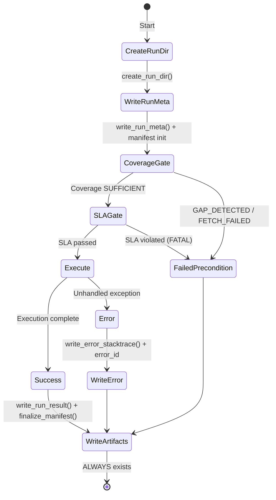

# Backtest-Atom: Reproducible & Auditable Backtesting

## Overview

The **Backtest-Atom** is the single source of truth (SSOT) for reproducible, auditable backtesting that enables deterministic promotion to Pre-Paper Trading.

**Core Promise:** Every backtest run either **SUCCEEDS** with complete artifacts or **FAILS DETERMINISTICALLY** with a clear, classified reason—never generic exceptions.

## What is a Backtest-Atom?

A Backtest-Atom is an **immutable, versioned backtest configuration** consisting of:

1. **Strategy Version** (impl_version + profile_version)
2. **Data Specification** (symbol, TF, ranges, sources)
3. **Run Manifest** (complete context + gate results + outcome)
4. **Artifacts** (signals, trades, metrics, equity curve)

### Key Properties

- **Reproducible**: Full context to recreate exact run (params, data spec, git commit)
- **Auditable**: Complete trail of what happened and why (gates, violations, errors)
- **Versioned**: Changes to behavior require version bump (impl/profile)
- **Immutable**: Approved atoms don't change—only new versions created
- **Promotion-ready**: Pre-Paper reuses same atom definition + adds history overlay

## Architecture

### Service Layer (Engine)

All business logic lives in `src/backtest/services/`:
- **UI-independent**: No Dash/Flask dependencies
- **Headless-testable**: Full test coverage without UI
- **DTO-based**: Structured data transfer objects (RunResult, CoverageCheckResult, SLAResult)

```
src/backtest/services/
├── data_coverage.py      # Coverage Gate
├── data_sla.py           # SLA Gate
├── run_status.py         # RunStatus/FailureReason/RunResult DTOs
├── artifacts_manager.py  # Fail-safe artifact creation
└── manifest_writer.py    # Run manifest for reproducibility
```

### State Machine



#### State Transitions

| From | To | Condition | Status | Artifacts |
|------|-----|-----------|---------|-----------|
| Coverage Gate | SLA Gate | Coverage SUFFICIENT | - | coverage_check.json |
| Coverage Gate | End | GAP_DETECTED | FAILED_PRECONDITION | coverage_check.json + run_result.json |
| SLA Gate | Execute | SLA passed (no FATAL) | - | sla_check.json |
| SLA Gate | End | SLA FATAL violations | FAILED_PRECONDITION | sla_check.json + run_result.json |
| Execute | End | Strategy complete | SUCCESS | All artifacts |
| Any | End | Unhandled exception | ERROR | run_result.json + error_stacktrace.txt |

**CRITICAL INVARIANT:** `run_result.json` and `run_manifest.json` **ALWAYS** exist, regardless of outcome.

## Run Manifest

The `run_manifest.json` contains complete reproducibility context for every run.

### Manifest Structure

```json
{
  "identity": {
    "run_id": "251215_144939_HOOD_15m_100d",
    "timestamp_utc": "2025-12-15T14:49:39Z",
    "commit_hash": "abc123def456",
    "market_tz": "America/New_York"
  },
  "strategy": {
    "key": "inside_bar",
    "impl_version": "1.0.0",
    "profile_version": "default"
  },
  "params": {
    "atr_period": 14,
    "min_mother_bar_size_atr_multiple": 1.5,
    "require_close_beyond_mother": true,
    "risk_reward_ratio": 2.0,
    "lookback_candles": 50,
    "max_pattern_age_candles": 5
  },
  "data": {
    "symbol": "HOOD",
    "requested_tf": "M15",
    "base_tf_used": "M5",
    "requested_range": {
      "lookback_days": 100,
      "requested_end_date": "2025-12-15"
    },
    "effective_range": {
      "start_ts": "2025-09-06T09:30:00-04:00",
      "end_ts": "2025-12-15T16:00:00-05:00"
    },
    "inputs": {
      "universe_parquet": "data/universe/stocks_data.parquet",
      "intraday_source_paths": ["data/intraday/M5/HOOD.parquet"]
    }
  },
  "gates": {
    "coverage": {
      "status": "sufficient",
      "cached_range": {
        "start": "2025-09-06T09:30:00-04:00",
        "end": "2025-12-15T16:00:00-05:00"
      },
     "gap": null,
      "auto_fetch_enabled": false,
      "fetch_attempted": false
    },
    "sla": {
      "checked_tf": "M5",
      "passed": true,
      "fatal_violations": [],
      "warning_violations": []
    }
  },
  "result": {
    "run_status": "success",
    "failure_reason": null,
    "failure_details": null,
    "error_id": null,
    "artifacts_index": [
      "signals.json",
      "trades.json",
      "metrics.json",
      "equity_curve.csv"
    ]
  }
}
```

### Manifest Lifecycle

1. **Initial**: Written after `write_run_meta()` (contains identity, strategy, params, data spec)
2. **Gate Updates**: Updated with coverage and SLA results as gates run
3. **Finalization**: Updated with final result + artifacts_index when `write_run_result()` is called

**Fail-Safe**: Manifest writing failures are logged but **NEVER crash** `run_result.json` writing.

## Run Outcomes

All backtest runs resolve to one of three deterministic statuses:

### 1. SUCCESS

**Meaning:** All gates passed, strategy executed successfully.

**Artifacts:**
- `run_meta.json` (start context)
- `run_manifest.json` (full reproducibility context)
- `coverage_check.json` (coverage gate result)
- `sla_check.json` (SLA gate result)
- `run_result.json` (final outcome)
- `signals.json` (pattern detections)
- `trades.json` (executed trades)
- `metrics.json` (performance metrics)
- `equity_curve.csv` (equity over time)

### 2. FAILED_PRECONDITION

**Meaning:** Gates blocked execution (data coverage gap, SLA violation).

**Reasons:**
- `DATA_COVERAGE_GAP`: Requested data not available (cached data has gap)
- `DATA_SLA_FAILED`: SLA violations (gaps in lookback, NaN in OHLC, etc.)

**Artifacts:**
- `run_meta.json`
- `run_manifest.json`
- `coverage_check.json` (or `sla_check.json`)
- `run_result.json` (with reason + details)

**Critical:** NO ERROR. This is a **deterministic, expected failure** with clear reason.

### 3. ERROR

**Meaning:** Unhandled exception during execution (bug, infrastructure issue).

**Artifacts:**
- `run_meta.json`
- `run_manifest.json`
- `coverage_check.json` / `sla_check.json` (if gates ran)
- `run_result.json` (with error_id)
- `error_stacktrace.txt` (full traceback + error_id)

**Critical:** This is an **unexpected failure**. error_id enables correlation across logs.

## Strategy Versioning

Strategy versions control behavior and ensure reproducibility.

### Version Components

- **impl_version**: Implementation version (code changes, bug fixes)
  - Example: `1.0.0` → `1.1.0` (bug fix in ATR calculation)
  
- **profile_version**: Configuration profile (parameter sets)
  - Example: `default` vs `aggressive` vs `conservative`

### Version Bump Rules

**MUST bump impl_version when:**
- Strategy logic changes (pattern detection, entry/exit rules)
- Bug fixes that affect signals/trades
- Any change to `src/strategies/inside_bar/core.py`

**MUST bump profile_version when:**
- Default parameter values change
- New required parameters added
- Parameter semantics change

**Golden Atom Rule:** If Golden Atom test fails after code change, you MUST:
1. Verify if behavior change is intentional
2. If intentional: **BUMP impl_version or profile_version**
3. Update Golden test's expected ranges (if needed)
4. Document change in release notes

## Gates

### Coverage Gate

**Purpose:** Ensure requested data is available before execution.

**Default:** `auto_fetch=False` (fail-fast)

**Outcomes:**
- `SUFFICIENT`: Data available for requested range → proceed
- `GAP_DETECTED`: Cached data has gap → FAILED_PRECONDITION
- `FETCH_FAILED`: auto_fetch enabled but fetch failed → FAILED_PRECONDITION

**Location:** `src/backtest/services/data_coverage.py`

### SLA Gate

**Purpose:** Validate data quality before strategy execution.

**FATAL Violations (block execution):**
- **no_nan_ohlc**: NaN in OHLC columns (breaks pattern detection)
- **gap-based completeness**: Missing bars in lookback window (breaks InsideBar consecutive bar requirement)
- **no_dupe_index**: Duplicate timestamps (data integrity issue)

**WARNING Violations (logged but don't block):**
- **ratio-based completeness**: <99% completeness ratio

**Base TF Awareness:** SLA checks appropriate timeframe:
- M15 run: checks `m15_completeness` (NOT m5)
- M5 run: checks `m5_completeness`

**Location:** `src/backtest/services/data_sla.py`

## Promotion to Pre-Paper Trading

The Backtest-Atom enables seamless promotion:

### Backtest Phase (Historical)

```python
atom = {
  "strategy": {"impl_version": "1.0.0", "profile_version": "default"},
  "data": {
    "symbol": "HOOD",
    "base_tf": "M5",
    "requested_range": {"lookback_days": 100, "requested_end": "2025-12-15"}
  }
}
# Source: Parquet cache (EODHD historical)
```

### Pre-Paper Phase (History + Live Overlay)

```python
# SAME atom definition
atom = load_approved_atom("251215_144939_HOOD_15m_100d")

# Different data source overlay:
# - History: Parquet cache (historical)
# - Live bars: SQLite (intraday capture)

# Strategy version UNCHANGED (1.0.0 / default)
# Parameters UNCHANGED (from manifest)
```

**Key Insight:** Pre-Paper uses the **exact same atom** but with hybrid data sourcing (historical + live). The strategy code, version, and params remain identical.

## Golden Atom Test

**Location:** `tests/test_golden_backtest_atom.py`

**Purpose:** SSOT stability gate for approved atoms.

**Golden Config:**
- Symbol: APP (known stable, good liquidity)
- Base TF: M5 (stable SSOT)
- Strategy: inside_bar v1.0.0 / profile:default
- Lookback: 100 days

**Assertions:**
- RunResult.status == SUCCESS
- Artifacts exist (run_manifest.json, signals, trades, metrics)
- Deterministic metrics within tolerances (not brittle file hashes)

**Rule:** If Golden test fails after code change → **MUST bump version**.

## Testing Strategy

### Unit Tests

- Coverage Gate: 5 tests (`test_data_coverage.py`)
- SLA Gate: 12 tests (`test_data_sla.py`)
- Artifacts Manager: 8 tests (`test_artifacts_manager.py`)
- Manifest Writer: 8 tests (`test_manifest_writer.py`)

### Integration Tests

- Pipeline Integration: 5 tests (`test_pipeline_integration.py`)
- Minimal Pipeline: Example + manual verification

### Regression Tests

- Coverage/SLA failures: 4 tests (`test_backtest_regression_red.py`)
- All transition from RED → GREEN as services implemented

### Golden Tests

- Golden Atom: 3 tests (`test_golden_backtest_atom.py`)
- Marker: `pytest -m golden`
- **CRITICAL:** Must pass for production promotion

## Invariants

1. **Market TZ**: Always `America/New_York` (immutable)
2. **Artifacts Always**: `run_result.json` + `run_manifest.json` exist for ALL outcomes
3. **No Generic Exceptions**: Every failure is classified (FAILED_PRECONDITION vs ERROR)
4. **auto_fetch Default**: `False` (fail-fast, no hidden network calls)
5. **Base TF Awareness**: SLA checks correct timeframe (M15 doesn't check m5_completeness)
6. **Gap-Based SLA**: InsideBar requires consecutive bars (any gap = FATAL)
7. **Manifest Fail-Safe**: Manifest writing errors never crash run_result writing
8. **UI Independence**: Engine logic in `src/backtest/services/` (no UI dependencies)

## File Locations

```
src/backtest/
├── services/
│   ├── data_coverage.py          # Coverage Gate
│   ├── data_sla.py               # SLA Gate
│   ├── run_status.py             # DTOs (RunStatus/FailureReason/RunResult)
│   ├── artifacts_manager.py      # Artifact creation
│   └── manifest_writer.py        # Run manifest
└── examples/
    └── minimal_pipeline.py        # Integration example

tests/
├── test_data_coverage.py          # Coverage Gate tests
├── test_data_sla.py               # SLA Gate tests (12 tests)
├── test_artifacts_manager.py      # Artifacts tests
├── test_manifest_writer.py        # Manifest tests
├── test_pipeline_integration.py   # Integration tests
├── test_backtest_regression_red.py # Regression tests
└── test_golden_backtest_atom.py   # Golden Atom tests

artifacts/backtests/<run_id>/
├── run_meta.json                  # Start context
├── run_manifest.json              # Full reproducibility context
├── coverage_check.json            # Coverage gate result
├── sla_check.json                 # SLA gate result
├── run_result.json                # Final outcome (ALWAYS exists)
├── error_stacktrace.txt           # Only on ERROR (with error_id)
├── signals.json                   # Pattern detections (SUCCESS only)
├── trades.json                    # Executed trades (SUCCESS only)
├── metrics.json                   # Performance metrics (SUCCESS only)
└── equity_curve.csv               # Equity over time (SUCCESS only)
```

## Future Work (Phase 5+)

- **Pre-Paper Integration**: Load approved atoms + overlay live data
- **Atom Registry**: Database of approved atoms for promotion
- **Version Migration**: Tools for upgrading atoms to new impl/profile versions
- **Multi-Symbol Support**: Batch backtests across universe
- **Parallel Execution**: Run multiple atoms concurrently
- **Result Comparison**: Diff atoms across versions

---

**Phase 4 Complete:** ✅ Manifest Writer, ✅ Golden Atom Test, ✅ Documentation
