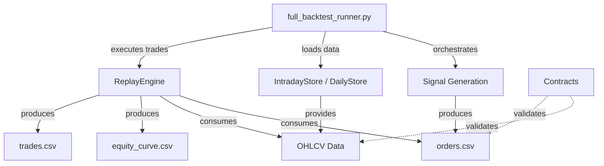

# axiom_bt Backtesting Framework - Interface Specification

**Document Version:** 1.0
**Date:** 2024-12-24
**Purpose:** Define canonical interfaces for intraday, daytrading, and hybrid backtesting modes

---

## Executive Summary

This document provides detailed interface specifications for the `axiom_bt` backtesting framework based on deep analysis of the codebase. The framework currently supports **intraday execution** and **daily MOC (Market-on-Close)** modes, with a clear separation between signal generation and trade simulation.

### Critical Findings

> [!WARNING]
> **Hybrid Mode Not Yet Implemented**
> The requested hybrid mode (daily signals + intraday SL/TP execution) is **not currently supported** in the codebase. The framework has two distinct execution paths that do not cross-communicate.

> [!IMPORTANT]
> **Timestamp Integrity**
> The framework uses strict timezone handling (UTC internally, configurable display timezone) and enforces RTH (Regular Trading Hours) filtering to prevent lookahead bias.

---

## Architecture Overview

### Core Components



### Data Flow

1. **Data Loading** → `IntradayStore` / `DailyStore` ensure data availability
2. **Signal Generation** → Strategy produces `orders.csv` with entry/SL/TP levels
3. **Coverage Gate** → Validates data completeness before execution
4. **Trade Simulation** → `ReplayEngine` simulates fills using M1/M5 bars
5. **Artifact Generation** → Produces equity curves, metrics, trade evidence

---

## Mode 1: Intraday Backtesting

### Interface Definition

**Current Implementation:** `simulate_insidebar_from_orders()`

#### Input Contract

```python
def simulate_insidebar_from_orders(
    orders_csv: Path,              # Orders with entry/SL/TP
    data_path: Path,               # Directory containing {SYMBOL}.parquet
    tz: str,                       # Market timezone (e.g., "America/New_York")
    costs: Costs,                  # Trading costs (fees_bps, slippage_bps)
    initial_cash: float,           # Starting capital
    data_path_m1: Optional[Path],  # M1 data directory (if different from data_path)
    requested_end: Optional[str],  # Backtest end timestamp
) -> Dict[str, Any]
```

#### Orders CSV Schema

| Column | Type | Required | Description |
|--------|------|----------|-------------|
| `symbol` | str | ✓ | Ticker symbol (uppercase) |
| `side` | str | ✓ | "BUY" or "SELL" |
| `order_type` | str | ✓ | "STOP" for intraday |
| `price` | float | ✓ | Entry stop price |
| `stop_loss` | float | ✓ | SL price level |
| `take_profit` | float | ✓ | TP price level |
| `valid_from` | datetime | ✓ | Order start timestamp (ISO format, UTC) |
| `valid_to` | datetime | ✓ | Order expiry timestamp (ISO format, UTC) |
| `oco_group` | str | ✓ | OCO (One-Cancels-Other) group ID |
| `qty` | float | ✓ | Position size (shares) |

#### Output Contract

```python
{
    "filled_orders": pd.DataFrame,  # Successfully filled orders
    "trades": pd.DataFrame,         # Complete trade lifecycle
    "equity": pd.DataFrame,         # Equity curve over time
    "metrics": dict,                # Performance metrics
    "orders": pd.DataFrame,         # Annotated orders with fill status
}
```

### Execution Semantics

#### Entry Logic (`_first_touch_entry`)

```python
def _first_touch_entry(
    df: pd.DataFrame,        # OHLCV bars (M1/M5)
    side: Side,              # "BUY" or "SELL"
    price: float,            # Entry price
    start: pd.Timestamp,     # valid_from
    end: pd.Timestamp,       # valid_to
) -> Optional[pd.Timestamp]
```

**Behavior:**
- **BUY**: Entry when `bar.High >= entry_price` (first touch within `[start, end]`)
- **SELL**: Entry when `bar.Low <= entry_price` (first touch within `[start, end]`)
- Returns **first bar timestamp** where condition met, or `None` if expired

> [!CAUTION]
> **Intra-bar Assumption**
> Current implementation uses **first touch within bar** (optimistic fill). Does NOT consider bid-ask spread or order book depth.

#### Exit Logic (`_exit_after_entry`)

```python
def _exit_after_entry(
    df: pd.DataFrame,
    side: Side,
    entry_ts: pd.Timestamp,
    stop_loss: Optional[float],
    take_profit: Optional[float],
    valid_until: pd.Timestamp,
) -> Tuple[pd.Timestamp, float, str]  # (exit_ts, exit_price, reason)
```

**Priority (per bar, evaluated in order):**

1. **SL AND TP both hit in same bar** → Exit at SL (conservative)
2. **SL hit** → Exit at SL price
3. **TP hit** → Exit at TP price
4. **Order expires (`valid_until`)** → Exit at bar close (reason: "EOD")

**Per-side logic:**
- **LONG (BUY)**: SL when `bar.Low <= stop_loss`, TP when `bar.High >= take_profit`
- **SHORT (SELL)**: SL when `bar.High >= stop_loss`, TP when `bar.Low <= take_profit`

> [!WARNING]
> **Same-bar SL/TP Priority**
> If both SL and TP are touched in the same bar, the engine **always exits at SL** (line 94-95, 103-104 in `replay_engine.py`). This is **conservative** but may underestimate TP fills.

#### Costs Application

**Slippage:**
- Applied to BOTH entry and exit
- BUY: `fill_price = limit_price * (1 + slippage_bps/10000)`
- SELL: `fill_price = limit_price * (1 - slippage_bps/10000)`

**Fees:**
- Calculated as `qty * fill_price * (fees_bps / 10000)`
- Applied to BOTH entry and exit
- Subtracted from PnL

---

## Mode 2: Daytrading (Daily MOC) Backtesting

### Interface Definition

**Current Implementation:** `simulate_daily_moc_from_orders()`

#### Input Contract

```python
def simulate_daily_moc_from_orders(
    orders_csv: Path,        # Orders CSV (daily signals)
    data_path: Path,         # Directory with D1 OHLCV data
    tz: str,                 # Market timezone
    costs: Costs,            # Trading costs
    initial_cash: float,     # Starting capital
) -> Dict[str, Any]
```

#### Orders CSV Schema (Daily)

| Column | Type | Required | Description |
|--------|------|----------|-------------|
| `symbol` | str | ✓ | Ticker symbol |
| `side` | str | ✓ | "BUY" or "SELL" |
| `valid_from` | datetime | ✓ | Trade date |
| `qty` | float | ✓ | Position size |

> [!NOTE]
> Daily mode does NOT use `stop_loss` / `take_profit` fields. All fills occur at **market-on-close** of the signal bar.

#### Execution Semantics

1. **Fill Price:** Close price of the bar matching `valid_from.date()`
2. **No Intraday Tracking:** Position is opened and immediately closed at same price
3. **PnL:** Only fees are deducted (no actual trade P&L in single-bar mode)

> [!CAUTION]
> **Incomplete Daily Implementation**
> Current daily MOC mode is a **stub** (line 441-561 in `replay_engine.py`). It fills orders at close but does NOT track multi-day positions or exits.

---

## Mode 3: Hybrid Backtesting (REQUESTED - NOT YET IMPLEMENTED)

### Specification Requirements

**Goal:** Generate signals from **daily candles** (e.g., D1 InsideBar pattern), but execute entry/SL/TP using **intraday bars** (M1/M5).

### Proposed Interface

```python
def simulate_hybrid_from_orders(
    orders_csv: Path,              # Orders with signal_timeframe marker
    signal_data_path: Path,        # D1 data for signal validation
    exec_data_path: Path,          # M1/M5 data for execution
    tz: str,
    costs: Costs,
    initial_cash: float,
) -> Dict[str, Any]
```

### Required Orders CSV Schema (Hybrid)

| Column | Type | Required | Description |
|--------|------|----------|-------------|
| `signal_timeframe` | str | ✓ | "D1" (daily signal) |
| `exec_timeframe` | str | ✓ | "M1" or "M5" (execution granularity) |
| `signal_bar_ts` | datetime | ✓ | Daily candle timestamp that triggered signal |
| `entry_valid_from` | datetime | ✓ | Intraday window start (e.g., next day 09:30) |
| `entry_valid_to` | datetime | ✓ | Intraday window end (e.g., same day 16:00) |
| `entry_price` | float | ✓ | Intraday stop entry price |
| `stop_loss` | float | ✓ | Intraday SL level |
| `take_profit` | float | ✓ | Intraday TP level |
| ... | ... | ... | (standard fields) |

### Execution Logic (Proposed)

````python
# Pseudo-code for hybrid execution
for order in orders:
    # 1. Validate signal bar exists in D1 data
    signal_bar = load_daily_bar(order.signal_bar_ts)
    if not validate_signal_pattern(signal_bar):
        skip_order()

    # 2. Load intraday window for execution
    intraday_bars = load_intraday_bars(
        symbol=order.symbol,
        start=order.entry_valid_from,
        end=order.entry_valid_to,
        timeframe=order.exec_timeframe
    )

    # 3. Attempt entry using intraday bars
    entry_ts = _first_touch_entry(
        df=intraday_bars,
        side=order.side,
        price=order.entry_price,
        start=order.entry_valid_from,
        end=order.entry_valid_to
    )

    if entry_ts is None:
        continue  # Order expired without fill

    # 4. Track exit using intraday bars
    exit_ts, exit_price, reason = _exit_after_entry(
        df=intraday_bars,
        side=order.side,
        entry_ts=entry_ts,
        stop_loss=order.stop_loss,
        take_profit=order.take_profit,
        valid_until=order.entry_valid_to + session_end_buffer
    )
````

### Critical Invariants for Hybrid Mode

> [!IMPORTANT]
> **Lookahead Bias Prevention**
> 1. Signal must be generated from **complete daily bar** (bar close timestamp)
> 2. Entry window must start **AFTER** signal bar close (e.g., next trading day 09:30)
> 3. Intraday execution bars must **NOT contain** signal bar timestamp

> [!IMPORTANT]
> **RTH Consistency**
> - If signal is generated from RTH-only D1 bar, execution **must** use RTH-only M1/M5 bars
> - `entry_valid_from` and `entry_valid_to` must align with RTH session (09:30-16:00 ET)

> [!WARNING]
> **Session Continuity**
> - If `entry_valid_to` extends across multiple days (swing trade), engine must handle:
>   - Overnight gaps (no execution outside RTH)
>   - Multi-day SL/TP tracking
>   - Proper exit at session boundaries

---

## Data Layer Specifications

### IntradayStore

**File:** [`intraday.py`](file:///home/mirko/data/workspace/droid/traderunner/src/axiom_bt/intraday.py)

#### Supported Timeframes

```python
class Timeframe(str, Enum):
    M1 = "M1"
    M5 = "M5"
    M15 = "M15"
```

#### Key Methods

**`ensure(spec: IntradaySpec, force: bool, auto_fill_gaps: bool)`**
- Checks local M1 coverage for requested date range
- Auto-fetches missing data from EODHD if `auto_fill_gaps=True`
- Resamples M1 → M5/M15 as needed
- **Filters to RTH session (09:30-16:00 ET)** via `filter_rth_session()`

**`load(symbol: str, timeframe: Timeframe, tz: str)`**
- Returns normalized OHLCV DataFrame
- Index: `DatetimeIndex` (tz-aware, in specified `tz`)
- Columns: `['open', 'high', 'low', 'close', 'volume']` (lowercase)

> [!NOTE]
> **RTH Filtering**
> All intraday data is **RTH-only** (line 410-424 in `intraday.py`). Pre-market and after-hours bars are excluded.

### DailyStore

**File:** [`daily.py`](file:///home/mirko/data/workspace/droid/traderunner/src/axiom_bt/daily.py)

#### Key Methods

**`load_universe(universe_path: Path, tz: str)`**
- Loads multi-symbol parquet (e.g., Rudometkin universe)
- Returns normalized frame with `['symbol', 'timestamp', 'open', 'high', 'low', 'close', 'volume']`

**`load_window(spec: DailySpec, lookback_days: int)`**
- Filters universe to specified symbols and date range
- Applies lookback extension for warmup period

---

## Contract Validation

### Data Contracts

**File:** [`contracts/data_contracts.py`](file:///home/mirko/data/workspace/droid/traderunner/src/axiom_bt/contracts/data_contracts.py)

#### `DailyFrameSpec`

**Required columns:** `['Open', 'High', 'Low', 'Close', 'Volume']` (TitleCase)

**Invariants:**
- Index must be `DatetimeIndex` (UTC tz-aware)
- Monotonic increasing, no duplicates
- No NaNs in OHLC
- OHLC consistency: `High >= max(Open, Close)`, `Low <= min(Open, Close)`

#### `IntradayFrameSpec`

Inherits all `DailyFrameSpec` invariants, plus:
- Session-aware validation (TODO: not yet implemented)
- No overnight gaps within sessions (TODO)

> [!WARNING]
> **Contract Enforcement Incomplete**
> Session validation for intraday frames is a TODO (line 137-140 in `data_contracts.py`). Current validation only checks column schema and timezone.

---

## Timestamp Handling & Lookahead Bias Prevention

### Critical Assumptions

1. **Signal Generation Timestamp**
   - Strategy must emit signals using **bar close timestamp**
   - Example: D1 bar for 2024-12-20 → signal timestamp = `2024-12-20 23:59:59.999999+00:00` (after bar complete)

2. **Order Validity Window**
   - `valid_from` must be **AFTER** signal bar close
   - Example: D1 signal at 2024-12-20 → `valid_from` = `2024-12-23 09:30:00-05:00` (next trading day)

3. **Execution Data Alignment**
   - Execution bars must start **AFTER** `valid_from`
   - No execution on signal bar itself (prevents lookahead)

### Current Safeguards

**In `full_backtest_runner.py`:**
- Lines 262-268: Extends data range with `warmup_days` to ensure indicator lookback
- Lines 355-356: Slices data to `[start_ts:end_ts]` using backtest window (no future data leakage)

**In `replay_engine.py`:**
- Lines 67-76: `_first_touch_entry` only searches `[start, end]` window
- Lines 271-272: Converts order `valid_from`/`valid_to` to target timezone **before** searching

> [!CAUTION]
> **Warmup Data Exposure**
> The `warmup_days` buffer (line 252-255 in `full_backtest_runner.py`) loads extra historical bars for indicators. Strategies MUST NOT emit signals during warmup period.

---

## Edge Cases & Known Issues

### Issue 1: Same-Bar SL/TP Priority

**File:** `replay_engine.py`, lines 94-95, 103-104

**Problem:** When both SL and TP are touched in same bar, engine **always exits at SL**.

**Impact:**
- Underestimates TP fill rate
- Lowers backtest performance vs. reality (conservative bias)

**Recommendation:**
````python
# Proposed: Use bar order (low→high for LONG, high→low for SHORT)
if side == "BUY":
    if bar.Low <= SL and bar.High >= TP:
        # Conservative: assume SL hit first
        return (ts, SL, "SL")
    elif bar.High >= TP and bar.Low <= SL:
        # Optimistic: assume TP hit first
        return (ts, TP, "TP")
````

### Issue 2: Intra-Bar Fill Timing

**Problem:** `_first_touch_entry` returns **bar open timestamp** when entry price is touched, but actual fill could occur anywhere in the bar.

**Impact:**
- Entry timestamp precision loss (M1: ±1min, M5: ±5min)
- Affects downstream metrics (hold time, intraday returns)

**Recommendation:**
- Add `fill_timing` parameter: `"bar_open"` | `"bar_close"` | `"midpoint"`

### Issue 3: Weekend/Holiday Gap Handling

**File:** `intraday.py`, lines 284-285

**Problem:** `ensure()` fetches data for all calendar days, including weekends (causes hangs per conversation history).

**Status:** Reportedly fixed (see conversation `fa7c1846-2f3f-4508-a6ff-49d1cadafcac`), but coverage gate should validate.

### Issue 4: Incomplete Daily MOC Mode

**Problem:** `simulate_daily_moc_from_orders` only fills at close but doesn't track multi-day positions.

**Impact:** Cannot backtest daily strategies with holding periods > 1 day.

**Recommendation:** Implement position tracking across bars:
````python
# Track open positions
positions = {}

for bar in daily_bars:
    # Check exits first
    for pos_id, pos in list(positions.items()):
        if should_exit(pos, bar):
            exit_trade(pos, bar.Close)
            del positions[pos_id]

    # Then check entries
    for order in orders_for_date(bar.timestamp):
        if should_enter(order, bar):
            positions[order.id] = enter_trade(order, bar.Close)
````

---

## Recommendations for Hybrid Mode Implementation

### Phase 1: Extend Orders Schema

1. Add `signal_timeframe` and `exec_timeframe` columns
2. Add `signal_bar_ts` (daily bar that generated signal)
3. Ensure `entry_valid_from` strictly **AFTER** `signal_bar_ts` bar close

### Phase 2: Modify ReplayEngine

Create `simulate_hybrid_from_orders()`:

````python
def simulate_hybrid_from_orders(
    orders_csv: Path,
    signal_data_path: Path,  # D1 data
    exec_data_path: Path,    # M1/M5 data
    tz: str,
    costs: Costs,
    initial_cash: float,
) -> Dict[str, Any]:
    orders = pd.read_csv(orders_csv)

    # Validate each order's signal bar exists
    daily_store = DailyStore(default_tz=tz)
    for idx, order in orders.iterrows():
        signal_bar = daily_store.load_bar(
            symbol=order.symbol,
            timestamp=order.signal_bar_ts
        )
        if signal_bar is None:
            raise ValueError(f"Signal bar missing: {order.signal_bar_ts}")

        # CRITICAL: Verify entry window starts AFTER signal bar close
        if order.entry_valid_from <= order.signal_bar_ts:
            raise ValueError("Lookahead detected: entry_valid_from must be AFTER signal_bar_ts")

    # Use existing intraday execution logic
    return _execute_intraday_orders(
        orders=orders,
        data_path=exec_data_path,
        tz=tz,
        costs=costs,
        initial_cash=initial_cash
    )
````

### Phase 3: Add Coverage Gate Extension

Extend `check_coverage()` to validate BOTH:
- Daily data availability for signal generation window
- Intraday data availability for execution window

### Phase 4: Testing Strategy

**Test Cases:**
1. **Lookahead Prevention**: Signal at D1 bar close → entry earliest next RTH session open
2. **Gap Handling**: Weekend signal → entry on Monday 09:30
3. **Multi-Day SL/TP**: Signal Mon → exit Wed (verify overnight gaps skipped)
4. **RTH Boundary**: Entry near 16:00 → rollover to next day if not filled

---

## Verification Checklist

### Intraday Mode

- [ ] Orders CSV validates against schema
- [ ] Entry only occurs within `[valid_from, valid_to]` window
- [ ] SL/TP priority matches documented behavior
- [ ] Costs (fees + slippage) applied to both entry and exit
- [ ] No execution outside RTH (09:30-16:00 ET)

### Daily MOC Mode

- [ ] Fills at close price of signal bar
- [ ] Only fees deducted (no slippage on MOC orders)
- [ ] Multi-day position tracking (when implemented)

### Hybrid Mode (When Implemented)

- [ ] Signal bar timestamp < entry window start
- [ ] Signal data (D1) and execution data (M1/M5) aligned
- [ ] No intraday bars from signal bar timestamp used in execution
- [ ] RTH enforcement across both signal and execution layers
- [ ] Weekend/holiday gap handling in multi-day trades

---

## Appendix: File References

### Core Files

| File | Purpose | Lines |
|------|---------|-------|
| [full_backtest_runner.py](file:///home/mirko/data/workspace/droid/traderunner/src/axiom_bt/full_backtest_runner.py#L146-L844) | Orchestration pipeline | 1405 |
| [replay_engine.py](file:///home/mirko/data/workspace/droid/traderunner/src/axiom_bt/engines/replay_engine.py#L60-L111) | Trade simulation engine | 562 |
| [intraday.py](file:///home/mirko/data/workspace/droid/traderunner/src/axiom_bt/intraday.py#L228-L425) | M1/M5/M15 data loading | 592 |
| [daily.py](file:///home/mirko/data/workspace/droid/traderunner/src/axiom_bt/daily.py#L76-L98) | D1 data loading | 176 |
| [data_contracts.py](file:///home/mirko/data/workspace/droid/traderunner/src/axiom_bt/contracts/data_contracts.py#L16-L101) | OHLCV validation | 154 |
| [order_schema.py](file:///home/mirko/data/workspace/droid/traderunner/src/axiom_bt/contracts/order_schema.py#L14-L141) | Order contract | 165 |

### Key Functions

| Function | File | Line | Description |
|----------|------|------|-------------|
| `_first_touch_entry` | replay_engine.py | 60-76 | Entry price detection |
| `_exit_after_entry` | replay_engine.py | 79-111 | SL/TP exit logic |
| `simulate_insidebar_from_orders` | replay_engine.py | 148-438 | Intraday backtest |
| `simulate_daily_moc_from_orders` | replay_engine.py | 441-561 | Daily MOC backtest |
| `run_backtest_full` | full_backtest_runner.py | 146-844 | Main orchestrator |
| `calculate_warmup_days` | full_backtest_runner.py | 40-80 | Warmup buffer calculation |

---

## Glossary

- **RTH**: Regular Trading Hours (09:30-16:00 ET for US markets)
- **OCO**: One-Cancels-Other (order group where fill of one cancels others)
- **MOC**: Market-on-Close (fill at session close price)
- **SL**: Stop Loss
- **TP**: Take Profit
- **SSOT**: Single Source of Truth
- **Lookahead Bias**: Using future data in historical simulation (major backtest flaw)
- **Warmup Period**: Historical bars needed for indicator calculation before backtest window
