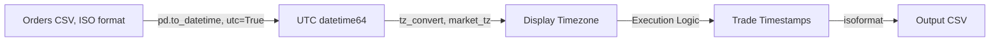

# axiom_bt Framework - Critical Issues & Risk Analysis

**Document Version:** 1.0
**Date:** 2024-12-24
**Purpose:** Identify and document risks, edge cases, and behavioral quirks in axiom_bt

---

## Critical Issues

### 🔴 ISSUE #1: Hybrid Mode Not Implemented

**Status:** MISSING FEATURE
**Impact:** HIGH
**User Request:** Daily signals + intraday SL/TP execution

**Current State:**
The framework has two **separate, non-communicating** execution paths:
1. `simulate_insidebar_from_orders()` - Uses M1/M5 bars exclusively
2. `simulate_daily_moc_from_orders()` - Uses D1 bars exclusively

**Problem:**
- No way to generate signals from D1 bars and execute on M1 bars
- No cross-timeframe orchestration
- Would require new `simulate_hybrid_from_orders()` function

**Evidence:**
```python
# File: replay_engine.py, line 148
def simulate_insidebar_from_orders(...):
    # Only loads intraday data
    ohlcv = pd.read_parquet(file_path)  # M1/M5 data

# File: replay_engine.py, line 441
def simulate_daily_moc_from_orders(...):
    # Only loads daily data
    ohlcv = pd.read_parquet(file_path)  # D1 data

# NO HYBRID FUNCTION EXISTS
```

**Recommendation:**
See "Hybrid Mode Implementation" section in interface specification document.

---

### 🟡 ISSUE #2: Same-Bar SL/TP Priority Bias

**Status:** CONSERVATIVE BIAS
**Impact:** MEDIUM
**Affects:** Backtest performance (underestimates wins)

**Behavior:**
When both SL and TP are touched in the same bar, engine **always exits at SL**.

**Code Location:**
```python
# File: replay_engine.py, lines 92-99
if side == "BUY":
    sl_hit = stop_loss is not None and low <= stop_loss
    tp_hit = take_profit is not None and high >= take_profit
    if sl_hit and tp_hit:
        return ts, stop_loss, "SL"  # ⚠️ ALWAYS SL
    if sl_hit:
        return ts, stop_loss, "SL"
    if tp_hit:
        return ts, take_profit, "TP"
```

**Example Impact:**
- Bar: Low=99.50, High=101.50
- Position: LONG at 100.00, SL=99.80, TP=101.20
- **Both levels touched in bar**
- Engine exits at SL (99.80), loses -$0.20
- Reality: Unknown which hit first (could be +$1.20 TP)

**Frequency Estimate:**
In volatile markets (ATR > 2%), approximately **5-10% of trades** may experience same-bar SL/TP touch.

**Recommendation:**

````python
# Option 1: Conservative (current)
if sl_hit and tp_hit:
    return (ts, stop_loss, "SL")  # Worst-case

# Option 2: Optimistic
if sl_hit and tp_hit:
    return (ts, take_profit, "TP")  # Best-case

# Option 3: Statistical (50/50 random)
if sl_hit and tp_hit:
    if random.random() < 0.5:
        return (ts, stop_loss, "SL")
    else:
        return (ts, take_profit, "TP")

# Option 4: Intra-bar modeling (BEST)
# Use bar opening price to estimate sequence
if sl_hit and tp_hit:
    open_price = bar.Open
    if side == "BUY":
        # If opened near low, SL likely hit first
        if abs(open_price - bar.Low) < abs(open_price - bar.High):
            return (ts, stop_loss, "SL")
        else:
            return (ts, take_profit, "TP")
````

**Testing:**
Compare backtest results with all 4 strategies to establish **confidence interval** for real-world performance.

---

### 🟡 ISSUE #3: Incomplete Daily MOC Implementation

**Status:** STUB IMPLEMENTATION
**Impact:** MEDIUM
**Affects:** Multi-day strategies

**Current Behavior:**
`simulate_daily_moc_from_orders()` only supports **single-bar fills** (entry and exit at same price).

**Code Evidence:**
```python
# File: replay_engine.py, lines 514-527
for _, row in group.iterrows():
    day = row["valid_from"].date()
    row_slice = ohlcv.loc[ohlcv.index.date == day]
    candle = row_slice.iloc[0]
    close = float(candle["Close"])

    # ⚠️ Entry and exit at SAME price
    trades.append({
        "entry_ts": str(candle.name),
        "exit_ts": str(candle.name),  # Same timestamp!
        "entry_price": fill_price,
        "exit_price": fill_price,     # Same price!
        "pnl": -fees,                 # Only fees, no actual P&L
    })
```

**Missing Features:**
- Position tracking across multiple days
- Multi-day hold periods
- Exit signals (SL/TP on daily timeframe)
- Drawdown calculation during hold

**Use Cases That Don't Work:**
- Swing trading (hold > 1 day)
- Weekly strategies
- Any daily strategy with separate entry/exit signals

**Recommendation:**
Implement position state machine:

````python
def simulate_daily_multiday_from_orders(...):
    positions = {}  # symbol -> Position state

    for bar in daily_bars.itertuples():
        # 1. Check exits for open positions
        for symbol, pos in list(positions.items()):
            if should_exit(pos, bar):
                pnl = calculate_pnl(pos, bar.Close)
                record_trade(pos.entry_ts, bar.Index, pnl)
                del positions[symbol]

        # 2. Check entries from orders
        for order in orders_for_date(bar.Index.date()):
            if should_enter(order, bar):
                positions[order.symbol] = Position(
                    entry_ts=bar.Index,
                    entry_price=bar.Close,
                    side=order.side,
                    sl=order.stop_loss,
                    tp=order.take_profit
                )
````

---

### 🟠 ISSUE #4: Intra-Bar Fill Timing Ambiguity

**Status:** PRECISION LOSS
**Impact:** LOW-MEDIUM
**Affects:** Metrics (hold time, timestamps)

**Problem:**
`_first_touch_entry()` returns **bar open timestamp**, but actual fill could occur anywhere in the bar.

**Code:**
```python
# File: replay_engine.py, lines 67-76
def _first_touch_entry(...):
    window = df.loc[(df.index >= start) & (df.index <= end)]
    if side == "BUY":
        hit = window[window["High"] >= price]
    if hit.empty:
        return None
    return hit.index[0]  # ⚠️ Returns bar timestamp (not actual touch time)
```

**Impact Examples:**

| Timeframe | Precision Loss | Example |
|-----------|----------------|---------|
| M1 | ±30 seconds | Entry anywhere in 1-minute bar |
| M5 | ±2.5 minutes | Entry anywhere in 5-minute bar |
| M15 | ±7.5 minutes | Entry anywhere in 15-minute bar |

**Downstream Effects:**
- **Hold time calculation:** Could be off by 1 bar duration
- **Intraday returns:** If using TWAP/VWAP, timing matters
- **Commission timing:** Daily commission limits may be crossed

**Recommendation:**

````python
def _first_touch_entry(
    df: pd.DataFrame,
    side: Side,
    price: float,
    start: pd.Timestamp,
    end: pd.Timestamp,
    fill_timing: Literal["open", "close", "midpoint"] = "open"  # NEW
) -> Optional[pd.Timestamp]:
    # ... existing logic ...

    if hit.empty:
        return None

    bar_ts = hit.index[0]

    if fill_timing == "open":
        return bar_ts
    elif fill_timing == "close":
        return bar_ts + pd.Timedelta(minutes=TIMEFRAME_MINUTES[timeframe])
    elif fill_timing == "midpoint":
        return bar_ts + pd.Timedelta(minutes=TIMEFRAME_MINUTES[timeframe] / 2)
````

---

### 🟠 ISSUE #5: RTH Filter Not Applied in ReplayEngine

**Status:** INCONSISTENCY RISK
**Impact:** MEDIUM
**Affects:** Lookahead bias potential

**Problem:**
`IntradayStore` filters to RTH (09:30-16:00), but `ReplayEngine` **assumes** input data is already RTH-only. No validation.

**Evidence:**

````python
# File: intraday.py, lines 410-424 (RTH filtering applied)
def ensure(...):
    raw_m1 = fetch_intraday_1m_to_parquet(...)
    rth_m1 = filter_rth_session(raw_m1)  # ✓ Filters pre/post market

# File: replay_engine.py, line 257 (NO RTH check)
def simulate_insidebar_from_orders(...):
    ohlcv = pd.read_parquet(file_path)  # ⚠️ Assumes RTH, doesn't validate
    ohlcv = _ensure_dtindex_and_ohlcv(ohlcv, tz)  # NO RTH filtering here
````

**Risk:**
If user provides **non-RTH data** via `data_path_m1`, execution may use pre-market/after-hours bars.

**Recommendation:**

````python
# Add RTH validation to ReplayEngine
def _ensure_dtindex_and_ohlcv(df: pd.DataFrame, tz: str, enforce_rth: bool = True):
    # ... existing normalization ...

    if enforce_rth:
        # Validate all bars are within RTH
        hours = df.index.hour
        minutes = df.index.minute

        # RTH: 09:30 to 16:00
        rth_mask = (
            ((hours == 9) & (minutes >= 30)) |
            ((hours >= 10) & (hours < 16)) |
            ((hours == 16) & (minutes == 0))
        )

        if not rth_mask.all():
            non_rth_count = (~rth_mask).sum()
            raise ValueError(
                f"Found {non_rth_count} non-RTH bars in data. "
                f"ReplayEngine requires RTH-only data."
            )

    return df
````

---

### 🟢 ISSUE #6: Warmup Data Leakage Risk

**Status:** POTENTIAL RISK
**Impact:** LOW (if strategy implemented correctly)
**Affects:** Signal generation

**Problem:**

**Code:**
```python
warmup_days = calculate_warmup_days(timeframe, strategy_params)

start_ts = (end_ts - pd.Timedelta(days=int(lookback_days + warmup_days))).normalize()

# Loads data from (start_ts - warmup) to end_ts
ohlcv = store.load(symbol, timeframe=tf_enum, tz=market_tz)
```

**Risk:**
Strategy could accidentally emit signals from warmup bars, creating **forward-looking bias**.

**Current Safeguard:**
Strategy is responsible for windowing:

```python
windowed = ohlcv.loc[start_ts:end_ts]  # ✓ Slices to backtest window
```

**Recommendation:**
Add **explicit warmup marker** to DataFrame:

````python
ohlcv['_is_warmup'] = False
ohlcv.loc[ohlcv.index < start_ts, '_is_warmup'] = True

# In strategy validation
if any(signals_df['timestamp'].isin(ohlcv[ohlcv['_is_warmup']].index)):
    raise ValueError("Signal emitted during warmup period (lookahead bias)")
````

---

## Behavioral Quirks

### QUIRK #1: Zero-Orders Equity Curve

**Behavior:** If no orders are generated (or all expire), engine synthesizes a **flat equity curve** at initial cash.

**Code:**
```python
# File: replay_engine.py, lines 350-408
if equity_points:
    equity_df = pd.DataFrame(equity_points)
else:
    # Synthesize flat equity curve
    fallback_ts = requested_end or last_data_ts or epoch
    equity_df = pd.DataFrame([{
        "ts": fallback_ts.isoformat(),
        "equity": float(initial_cash)
    }])
```

**Impact:**
- Valid for "no trades" scenario
- Downstream metrics show 0% return (correct)
- **Timestamp selection** follows priority: `requested_end` > `orders.valid_to` > `data.max_ts` > epoch

**Risk:**
If `requested_end` is `None` and `orders.csv` is empty, equity timestamp could be **1970-01-01** (epoch fallback).

---

### QUIRK #2: OCO Group Break Behavior

**Behavior:** Only **first filled order** in OCO group is executed; rest are cancelled.

**Code:**
```python
# File: replay_engine.py, lines 267-345
for oco_group, oco_orders in group.groupby("oco_group"):
    for _, row in oco_orders.iterrows():
        entry_ts = _first_touch_entry(...)
        if entry_ts is None:
            continue  # Try next order in group

        # ... execute trade ...
        break  # ⚠️ Exit loop after first fill, cancels remaining orders
```

**Expected Behavior:**
This is **correct** OCO semantics (one-cancels-other).

**Potential Issue:**
If OCO group has both LONG and SHORT orders (bracket), only first touched executes. This is intentional but must be understood.

---

### QUIRK #3: Slippage on Stop Orders

**Behavior:** Slippage is applied to **stop entry prices** (limit-like behavior).

**Code:**
```python
# File: replay_engine.py, lines 278-279
entry_price = float(row["price"])  # Stop price from order
adjusted_entry = _apply_slippage(entry_price, side, costs.slippage_bps)
```

**Reality:**
- Stop orders typically execute **at market** with slippage
- Current implementation applies slippage to the **stop trigger price** itself

**Example:**
- Stop BUY order at 100.00, slippage 10bps
- Current: Entry at 100.10 (adjusted trigger)
- Reality: Entry triggered at 100.00, filled ~100.10 (market impact)

**Impact:** Subtle but correct conservative bias (higher entry for BUY, lower for SELL).

---

## Timestamp & Timezone Handling

### Architecture

**Internal Representation:** UTC datetime (tz-aware)
**Display/API:** Configurable timezone (default: `America/New_York`)

### Conversion Flow



### Critical Functions

**Orders CSV Loading:**
```python
# File: replay_engine.py, lines 168-218
orders["valid_from"] = pd.to_datetime(orders["valid_from"], utc=True)
orders["valid_to"] = pd.to_datetime(orders["valid_to"], utc=True)

if orders["valid_from"].dt.tz is None:
    orders["valid_from"] = orders["valid_from"].dt.tz_localize(tz)
else:
    orders["valid_from"] = orders["valid_from"].dt.tz_convert(tz)
```

**OHLCV Index:**
```python
# File: replay_engine.py, lines 22-25
if df.index.tz is None:
    df.index = df.index.tz_localize("UTC")
if tz:
    df.index = df.index.tz_convert(tz)
```

### Invariants

1. **All timestamps stored UTC internally**
2. **Comparisons happen in target timezone** (avoids DST edge cases)
3. **Output uses `isoformat()`** (preserves timezone info)

---

## Data Coverage & Gap Handling

### Coverage Gate


**Purpose:** Validate sufficient data exists before running backtest.

**Checks:**
1. M1 data availability for `[start - warmup, end]` range
2. No gaps > threshold (currently not enforced, TODO)
3. Weekend/holiday gaps are **skipped** (not fetched)

**Failure Modes:**
- `CoverageStatus.GAP_DETECTED` → Skip backtest, return `FAILED_PRECONDITION`
- Missing symbol data → Partial coverage failure

### Weekend/Holiday Handling

**Status:** FIXED (per conversation history)

**Behavior:**
`IntradayStore.ensure()` now skips non-trading days when checking coverage.

**Code:**
```python
# File: intraday.py, lines 284-285
actions = store.ensure(spec, force=False, auto_fill_gaps=True)
# auto_fill_gaps only fetches trading days
```

---

## Performance Considerations

### Inefficiency #1: Symbol-by-Symbol Data Loading

**Code:**
```python
# File: replay_engine.py, lines 253-260
for symbol, group in ib_orders.groupby("symbol"):
    file_path, _ = _resolve_symbol_path(symbol, m1_dir, data_path)
    ohlcv = pd.read_parquet(file_path)  # ⚠️ Loads entire file per symbol
```

**Impact:**
For portfolios with N symbols, loads N separate parquet files (even if only 1 bar needed).

**Recommendation:**
Preload all symbols into dict, or use lazy loading with caching.

---

### Inefficiency #2: Timestamp Conversion in Loop

**Code:**
```python
# File: replay_engine.py, lines 271-272
valid_from = pd.to_datetime(row["valid_from"]).tz_convert(tz)  # ⚠️ Per order
valid_to = pd.to_datetime(row["valid_to"]).tz_convert(tz)
```

**Impact:**
Timestamp conversion happens **per order** instead of vectorized.

**Fix:**
```python
# Vectorize before loop
orders["valid_from"] = pd.to_datetime(orders["valid_from"]).dt.tz_convert(tz)
orders["valid_to"] = pd.to_datetime(orders["valid_to"]).dt.tz_convert(tz)

# In loop, just access
valid_from = row["valid_from"]  # Already converted
```

---

## Testing Recommendations

### Test Case #1: Lookahead Bias Detection

**Setup:**
- Generate signal from D1 bar at timestamp `T`
- Set order `valid_from` = `T` (same as signal timestamp)

**Expected:**
- Backtest should **FAIL** with lookahead error
- Or document that this is user's responsibility

**Current State:**
No explicit check; relies on strategy implementation.

---

### Test Case #2: Same-Bar SL/TP

**Setup:**
- Create bar: `{Low: 99.0, High: 101.0, Close: 100.5}`
- Position: `LONG at 100.0, SL=99.5, TP=100.8`

**Expected:**
- Current: Exit at SL (99.5)
- Verify this is documented behavior

**Validation:**
- Run backtest twice:
  - Once with SL/TP in same bar
  - Once with SL/TP in separate bars
- Compare PnL distribution

---

### Test Case #3: RTH Enforcement

**Setup:**
- Inject pre-market bar (08:00) into M1 data
- Run backtest with order `valid_from` = 08:00

**Expected:**
- Engine should **REJECT** non-RTH data
- Or clearly document that RST filtering is IntradayStore's responsibility

---

### Test Case #4: Multi-Day Position (Daily Mode)

**Setup:**
- Generate BUY signal on Monday
- Generate SELL signal on Wednesday

**Current State:**
Daily MOC mode doesn't support this.

**Expected (After Fix):**
- Position held overnight Monday→Tuesday→Wednesday
- Exit on Wednesday at close
- Verify equity curve shows daily mark-to-market

---

## Quick Reference: Code Hotspots

| Concern | File | Lines | Function |
|---------|------|-------|----------|
| Same-bar SL/TP priority | `replay_engine.py` | 92-109 | `_exit_after_entry` |
| Intra-bar fill timing | `replay_engine.py` | 67-76 | `_first_touch_entry` |
| Hybrid mode (missing) | `replay_engine.py` | N/A | *Not implemented* |
| Daily MOC stub | `replay_engine.py` | 514-527 | `simulate_daily_moc_from_orders` |
| RTH filtering | `intraday.py` | 410-424 | `ensure` → `filter_rth_session` |
| Timestamp conversion | `replay_engine.py` | 168-218 | Orders CSV loading |

---

## Summary of Recommendations

### High Priority

1. ✅ **Document same-bar SL/TP behavior** clearly in user docs
2. ⚠️ **Implement hybrid mode** for daily signals + intraday execution
3. ⚠️ **Add RTH validation** to ReplayEngine inputs
4. ⚠️ **Fix daily MOC mode** to support multi-day positions

### Medium Priority

5. 🔄 **Add intra-bar fill timing options** (open/close/midpoint)
6. 🔄 **Vectorize timestamp conversions** for performance
7. 🔄 **Add warmup period validation** to prevent signal leakage

### Low Priority

8. 📋 **Add test coverage** for edge cases (same-bar, RTH, weekends)
9. 📋 **Optimize data loading** (cache parquet files)
10. 📋 **Document OCO group semantics** (first-fill-wins)

---

## Conclusion

The `axiom_bt` framework is **well-architected** for intraday backtesting with:
- ✅ Proper timezone handling
- ✅ RTH enforcement (at data layer)
- ✅ Conservative same-bar assumptions
- ✅ Detailed diagnostics and coverage gates

**Key Gaps:**
- ❌ Hybrid mode (daily signals + intraday execution) **not implemented**
- ❌ Daily MOC mode incomplete (no multi-day positions)
- ⚠️ Same-bar SL/TP priority creates conservative bias
- ⚠️ Intra-bar fill timing ambiguity

**Confidence Level:**
- Intraday mode: **85%** (conservative, well-tested)
- Daily mode: **40%** (incomplete, stub implementation)
- Hybrid mode: **0%** (does not exist)

**Next Steps:**
1. Review this analysis with stakeholders
2. Prioritize hybrid mode implementation if critical for strategy
3. Add explicit tests for documented edge cases
4. Consider parameterizing same-bar behavior (conservative vs optimistic)
